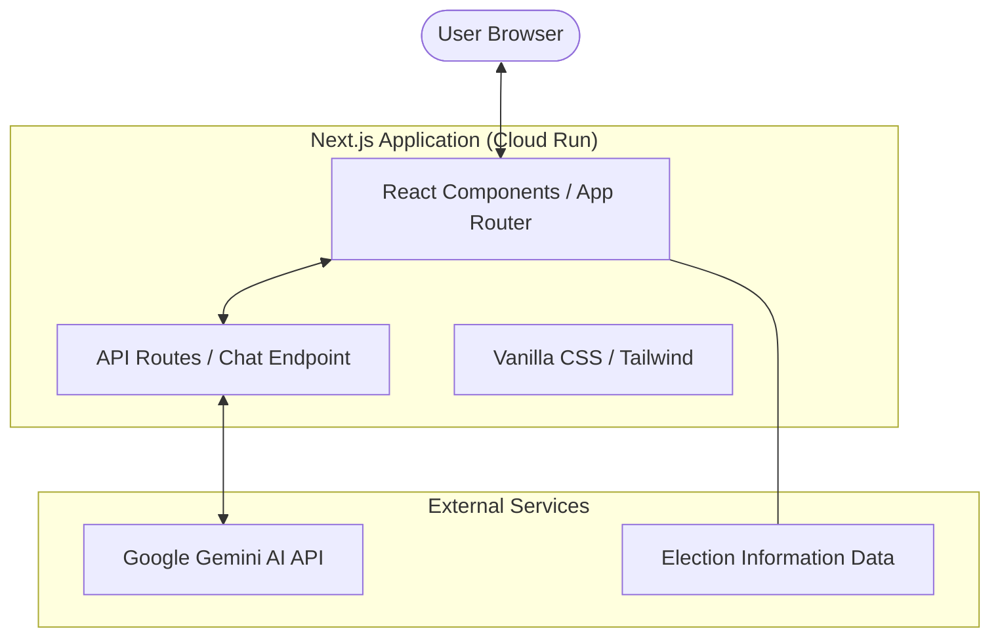

# Indian Election Assistant 🇮🇳

An interactive, educational web application designed to help citizens understand the Indian electoral process, timelines, and procedural steps through modern technology and AI.

## 🚀 Live Demo
**Cloud Run URL:** [https://election-assistant-492551505956.us-central1.run.app](https://election-assistant-492551505956.us-central1.run.app)

## ✨ Features

- **Interactive Election Process**: A step-by-step interactive timeline detailing the journey from delimitation to result declaration.
- **AI Election Assistant**: A dedicated chat interface powered by Google Gemini to answer questions about Indian elections neutrally and factually.
- **Educational Content**: In-depth information on the Election Commission of India (ECI), EVMs, VVPATs, and the Model Code of Conduct.
- **Flashcards**: Master electoral terminology with a 3D-flipping glossary.
- **Interactive Quizzes**: Test your knowledge of the democratic process with real-time feedback and scoring.
- **Modern UI/UX**: Premium design utilizing an Indian flag-inspired color palette, glassmorphism, and responsive layouts.

## 🏗️ Architecture Diagram



## 🛠️ Tech Stack

- **Framework**: Next.js (App Router)
- **Language**: TypeScript
- **Styling**: Tailwind CSS & Modern Vanilla CSS
- **AI SDK**: Vercel AI SDK
- **Icons**: Lucide React
- **Animations**: Framer Motion
- **Deployment**: Google Cloud Run (Dockerized)

## 🚦 Getting Started

### Prerequisites
- Node.js 20+
- A Google Gemini API Key

### Local Setup
1. Clone the repository:
   ```bash
   git clone https://github.com/Nagaraj1399/Election-Assistant.git
   cd Election-Assistant
   ```

2. Install dependencies:
   ```bash
   npm install
   ```

3. Create a `.env.local` file and add your API key:
   ```env
   GOOGLE_GENERATIVE_AI_API_KEY=your_gemini_api_key
   ```

4. Run the development server:
   ```bash
   npm run dev
   ```
   Visit `http://localhost:3000` to see the app.

## 🚢 Deployment

The project is configured for one-click deployment to **Google Cloud Run** using the provided `Dockerfile`.

```bash
gcloud run deploy election-assistant --source .
```

---
*Built to empower and educate the citizens of the world's largest democracy.*
